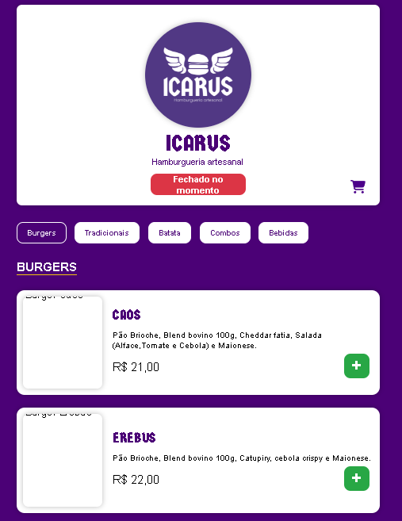

# 🍔 ICARUS - Cardápio Web

---

## 🧭 Visão Geral

O **ICARUS - Cardápio Web** é um sistema interativo desenvolvido para exibir o cardápio de uma hamburgueria de forma moderna, prática e intuitiva.  
O projeto foi criado com **HTML, CSS e JavaScript puro**, com foco em **simplicidade, responsividade e experiência do usuário**.  

O site conta com:
- Exibição dinâmica de produtos (hambúrgueres, acompanhamentos e bebidas);
- Modal para **seleção de adicionais personalizados**;
- Modal do **carrinho de compras** com cálculo automático;
- Sistema de **envio de pedidos via WhatsApp**;
- Verificação de **status da loja (aberto ou fechado)**;
- Persistência do carrinho com **LocalStorage**.

---

## 🚀 Demonstração

> 💡 Você pode visualizar a versão mais recente online ou abrir o arquivo `index.html` no navegador.

🔗 **Repositório GitHub:** [github.com/LucMancebo/CARDAPIO-WEB](https://github.com/LucMancebo/CARDAPIO-WEB)

📸 *Exemplo visual*  

